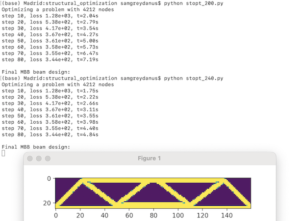

# Fast Structural Optimization in 200 Lines of Python

[Blog post](https://greydanus.github.io/2022/05/08/structural-optimization/) | [Paper]() | [Colab notebook](https://bit.ly/394DUcL)

Structural optimization lets us design trusses, bridges, and buildings starting from the physics of elastic materials. Let's code it up, from scratch, in 200 lines (forty of these lines are whitespace and comments).

There are two self-contained Python files in this directly. The first, `stopt_200.py`, provides the basic code you'll need in order to do structural optimization. The second, `stopt_240.py` adds LRU caching for NumPy arrays, which speeds up the code by 2x. Since caching isn't strictly necessary in a teaching example, we decided to separate it out. If you want to run this code on a larger problem, though, definitely use it!

To run this code: clone the repo, `cd` into it, and run `python stopt_200.py ` or `python stopt_240.py `

## Scaling to larger designs

Designing the eves of a gazebo:

Designing a causeway bridge:

Designing a structure that supports a grid of offset points:

Designing a staircase:

Designing a multistory building:

## Dependencies

This project uses `numpy` for dense matrix operations, `scipy` for sparse matrix operations, `matplotlib` for plotting, `autograd` for computing gradients, and `nlopt` for optimization. The only library that needs to be manually installed on Google Colab is `nlopt`.

## Final comments

In sci-fi representations of the healthy cities of the future, we often find manmade structures that are well integrated with their natural surroundings. Sometimes we even see a convergence where nature has adapted to the city and the city has adapted to nature. The more decadent cities, on the other hand, tend to define themselves in opposition to the patterns of nature. Their architecture is more blocky and inorganic. Perhaps tools like structural optimization can help us build the healthy cities of the future ..... while steering clear of the decadent ones.

